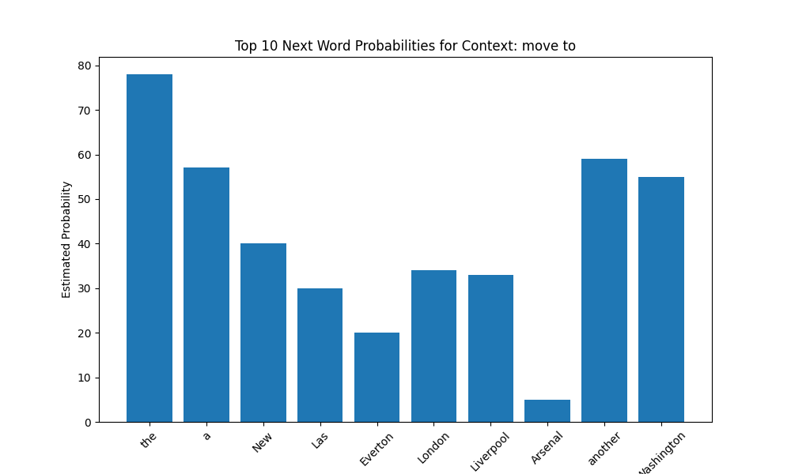
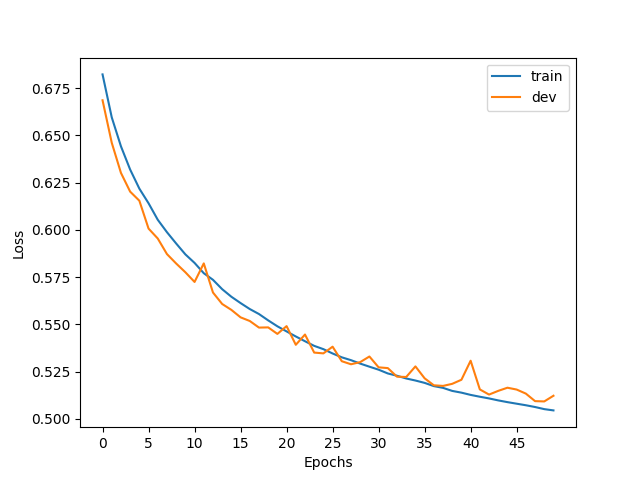

## 1 Concepts, intuitions, and big picture

1. Due to the sparsity problem, it is difficult/impossible to train n-gram models with $n>>5$. Therefore, n-gram models/Markov assumption will not capture long-term dependencies. For example, "The coffee, which I drank in the morning while leisurely reading my book, was a perfect start to the cold day." The sentence gives a lot of context to the subject before the verb and adjectives. A 5-gram model for instance would not be able to connect the "perfect start to the cold day" with "coffee". 
   
Another example is when the adjective order changes, but the distinct n-grams do not. The sentence, "At the new restaurant, the service was good, but the food was bad" and "At the new restaurant, the service was bad, but the food was good", have opposite meanings but their 2-grams are identical (and the sentences would appear the same to a 2-gram model). Similarly, a 2-gram model would also struggle to notice the difference between the "The dog chased the cat" and "The cat chased the dog".

2. Language can be quite redundant and grammatical structure often depend heavily on local context. n-gram models capture grammatical structure of what are reasonable words that follow one another. For example, it will generally expect a verb to follow a subject, or a noun to follow the definite article "the". In addition, some words tend to appear in fixed pairs or groups, such as "New York" or "social media".

3. In the lectures, we derive: 

$$ppl(w_1, \dots, w_n) = P(w_1, w_2, \dots, w_n)^{-\frac{1}{n}}= n\sqrt{\prod_{i=1}^n\frac{1}{P(w_i | w_{j<i})}}=2^{-\frac{1}{n}\sum_{i=1}^n log_2 P(w_i|w_{j<i})}:= 2^H$$

The H term in the equation above is the cross-entropy loss between our language model probabilities and the (empirical) real language probabilities. Hence, minimizing perplexity is equivalent to minizing cross-entropy.

4. For a vocabulary of $|V|$ words, if the predictions were completely random, we would expect perplexity to be $|V|$. For $|V|=2000$, perplexity is $2000$ and cross-entropy is $log(2000) \approx 7.60$ and for $|V|=2000$, perplexity is $10000$ and cross-entropy is $log(10000) \approx 9.21$.

5. Selections 1,3,4. 
6. Selection 2.
7. Option 3.

## Linear Algebra Recap

### 2.1 Gradients

1.

$$\frac{\partial f}{\partial x} = 2xy$$
$$\frac{\partial f}{\partial y} = x^2+6cos(z+6y)$$
$$\frac{\partial f}{\partial z} = cos(z+6y)$$

2. 

$$\begin{bmatrix}2xy \\ 
x^2+6cos(z+6y) \\
cos(z+6y) \end{bmatrix}_{|\theta = [3,\pi/2,0]^T} = \begin{bmatrix}3\pi \\ 
3 \\
-1 \end{bmatrix}$$

### 2.2 Gradients of vectors

$\frac{\partial}{\partial x_i}\mathbf{x}^\top \mathbf{c}$ is a vector.

$$\mathbf{x}^\top \mathbf{c} = \sum_{j=1}^n x_j c_j, \frac{\partial}{\partial x_i} \sum x_j c_j = c_i, \frac{\partial}{\partial \mathbf{x}} (\mathbf{x}^\top \mathbf{c}) = \mathbf{c}^\top$$


$\frac{\partial}{\partial \mathbf{x}} (\|\mathbf{x}\|_2^2)$ is a vector.

$$\frac{\partial}{\partial \mathbf{x}} (\|\mathbf{x}\|_2^2) = \frac{\partial}{\partial \mathbf{x}} \mathbf{x}^\top \mathbf{x} = \frac{\partial}{\partial \mathbf{x}} \sum_{j=1}^n x_j^2$$

$$\frac{\partial}{\partial x_i} (x_1^2 + \dots + x_i^2 + \dots) = 2x_i,
\frac{\partial}{\partial \mathbf{x}} (\|\mathbf{x}\|_2^2)= 2\mathbf{x}^\top$$

$\frac{\partial}{\partial \mathbf{x}} (\mathbf{Ax})$ is a matrix. $y=\mathbf{Ax}$ is a vector and it's $i$-th element is $y_i = \sum_{j=1}^n A_{ij}x_j$

$$\frac{\partial y_i}{\partial x_k} = A_{ik}, \frac{\partial}{\partial \mathbf{x}} (\mathbf{Ax}) = \mathbf{A}$$

$\frac{\partial}{\partial \mathbf{x}} (\mathbf{x}^\top \mathbf{Ax})$ is a vector.

$$ \frac{\partial}{\partial \mathbf{x}} (\mathbf{x}^\top \mathbf{Ax}) = \frac{\partial}{\partial \mathbf{x}}\sum_i \sum_j x_i A_{ij} x_j $$

$$ \frac{\partial f}{\partial x_k} = \sum_j A_{kj}x_j + \sum_i x_i A_{ik} $$

The first term $\sum_{j=1}^n A_{kj}x_j$ is the $k$-th element of the vector $\mathbf{Ax}$.The second term $\sum_{i=1}^n x_i A_{ik}$ is the $k$-th element of the vector $\mathbf{x}^\top \mathbf{A}$ (or $\mathbf{A}^\top \mathbf{x}$).

$$\frac{\partial}{\partial \mathbf{x}} (\mathbf{x}^\top \mathbf{Ax}) = (\mathbf{Ax})^\top + \mathbf{x}^\top \mathbf{A} = \mathbf{x}^\top \mathbf{A}^\top + \mathbf{x}^\top \mathbf{A} = \mathbf{x}^\top(\mathbf{A}^\top + \mathbf{A})$$

### 2.3 Jacobian

1.

$$\mathbf{J} = \frac{\partial \mathbf{f}}{\partial \theta} = \begin{bmatrix} 
\frac{\partial f_1}{\partial x_1} & \frac{\partial f_1}{\partial x_2} & \frac{\partial f_1}{\partial x_3} \\
\frac{\partial f_2}{\partial x_1} & \frac{\partial f_2}{\partial x_2} & \frac{\partial f_2}{\partial x_3} \\
\frac{\partial f_3}{\partial x_1} & \frac{\partial f_3}{\partial x_2} & \frac{\partial f_3}{\partial x_3}
\end{bmatrix} = \begin{bmatrix} 
x_2 x_3 \cos(x_1 x_2 x_3) & x_1 x_3 \cos(x_1 x_2 x_3) & x_1 x_2 \cos(x_1 x_2 x_3) \\
0 & -\sin(x_2 + x_3) & -\sin(x_2 + x_3) \\
0 & 0 & -\frac{1}{2}\exp(-\frac{1}{2}x_3)
\end{bmatrix}$$

2. Plug in $\theta = [1, \pi, 0]^\top$.

$$\mathbf{J}(1, \pi, 0) = \begin{bmatrix} 
0 & 0 & \pi \\
0 & 0 & 0 \\
0 & 0 & -0.5
\end{bmatrix}$$

## 3 n-gram Language Models

### 3.1 A toy n-gram language model

$$P(rabbit) = \frac{3}{29}$$
$$P(rabbit|roger) = \frac{1}{2}$$
$$P(EOS|rabbit) = 1$$

The sparsity problem means that the training corpus does not contain all possible valid word combinations. In this toy example, the bigram "rabbit framed" never appears, and is assigned a probability of 0. Any sentence containing this bi-gram will be assigned a probability of 0. n-gram models also cannot generalize new word combinations that are not in the training data. As n increases, the n-gram model is more likely to run into the sparsity problem.

## 4 Challenges of linear classifiers of sentences

1. Let us denote $w_1 = \text{good}, w_2 = \text{not}, w_3 = \text{bad}$ and $v_1, v_2, v_3$ their corresponding embeddings. 

$$f(\text{good};\theta) = \theta \cdot v_1 > \theta \cdot v_1 + \theta \cdot v_2 = f(\text{not good}; \theta) \Leftrightarrow \theta \cdot v_2 < 0$$

$$f(\text{bad};\theta) = \theta \cdot v_3 < \theta \cdot  v_2 + \theta \cdot v_3 = f(\text{not bad}; \theta) \Leftrightarrow \theta\cdot v_2 > 0$$

There cannot exist any $\theta$ such that $\theta \cdot v_2 < 0$ and $\theta \cdot v_2 > 0$. Therefore, the pair of inequalities cannot both hold.

2.

$$f(\text{happy};\theta) < f(\text{very happy};\theta)$$
$$f(\text{sad};\theta) > f(\text{very sad};\theta)$$

3. For consistency, I will keep the notation above: $w_1 = \text{good}, w_2 = \text{not}, w_3 = \text{bad}$ and $v_1, v_2, v_3$ their corresponding embeddings. Let $\theta = [-1, 1]$, $v_{\text{not}} = [2, 1]$, $v_{\text{good}} = [1, 0]$, and $v_{\text{bad}} = [-2, 0]$

$$f(\text{good}) = [-1, 1] \cdot \text{ReLU}([1, 0]) = -1 > -2 = [-1, 1] \cdot \text{ReLU}([3, 1]) \text{not good}; \theta)$$

$$f(\text{bad}; \theta) = [-1, 1] \cdot \text{ReLU}([-2, 0]) = 0 < 1 = [-1, 1] \cdot \text{ReLU}([2, 1] + [-2, 0]) = f(\text{not bad}; \theta)$$

4. Linear models often fail because it assumes words within a sentence contribute independently and additively to the meaning. Neural networks which can use non-linear activation functions like ReLU. Linear models fail to capture non-linear relationships, for example words that flip the meaning of the sentence like "not".

## 5 Softmax function

1.

$$\sigma(\mathbf{z} + c)_i = \frac{e^{z_i + c}}{\sum_{j=1}^K e^{z_j + c}} = \frac{e^{z_i}e^{c}}{\sum_{j=1}^K e^{z_j}e^{c}} = = \frac{e^{c}}{e^{c}}\frac{e^{z_i}}{\sum_{j=1}^K e^{z_j}} = 1\times\frac{e^{z_i}}{\sum_{j=1}^K e^{z_j}} = \sigma(\mathbf{z})_i $$

$$\Rightarrow \sigma(\mathbf{z} + c)_i = \sigma(\mathbf{z})_i $$

2. Let $S = \sum_{j=1}^K e^{z_j}$. Then $\forall i, \sigma(\mathbf{z})_i = \frac{e^{z_i}}{S}$. Since $e^{x}$ is a monotonic increasing function, $\sigma(\mathbf{z})_i$ must be as well. 

$$z_i > z_j \iff e^{z_i} > e^{z_j} \iff \frac{e^{z_i}}{\text{S}} > \frac{e^{z_j}}{\text{S}}$$

Therefore, the largest index in $\mathbf{z}$ is still the largest index in $\sigma(\mathbf{z})$.

3. 

$$\sigma_1([z_1, z_2]) = \frac{e^{z_1}}{e^{z_1} + e^{z_2}} = \frac{1}{1 + \frac{e^{z_2}}{e^{z_1}}} = \frac{1}{1 + e^{z_2-z_1}} = \frac{1}{1 + e^{-(z_1-z_2)}} = S(z_1-z_2)$$

4.

$$\sigma(\mathbf{z})_i = \frac{e^{z_i}}{\sum_{j=1}^K  e^{z_j}} = \frac{1}{\sum_{j=1}^K e^{z_j - z_i}} = \frac{1}{1 + \sum_{j \neq i} e^{-(z_i - z_j)}} \geq \frac{1}{\prod_{j \neq i} (1 + e^{-(z_i - z_j)})} = \prod_{j \neq i} \frac{1}{1 + e^{-(z_i - z_j)}} = \prod_{j \neq i} S(z_i - z_j)$$

## 6 Programming

### 6.1 Counting LMs

#### 6.1.4

For the context "move to", the model assigns high probability to determiners ("the", "a", "another"), indicating that a noun phrase should follow. Other high probability next words in the top 10 are all locations, which reasonably fit into the context of transfering something/someone. In contrast, the context "the news" is followed primarily by functional words like prepositions ("of", "with") and conjunctions ("that"), or related nouns ("media", "reports"). These examples show that the 3-gram model reasonably captures local semantic and syntax.




#### 6.1.5

These text generation examples repeat are repeating the same phrases in a loop. This is happening because we designed the model to deterministically pick the highest probability next word combined with the limitations of the Markov assumption for our 3-gram model. When our model generates a sequence of words that accidentally lead to the previous 2-word combination, we end up in a closed loop. 


```
---------- generated text 1 ----------
According to the report, the first time in the United States, and the other hand, the first time in the United States, and the other hand, the first time
---------- generated text 2 ----------
The president of the association ' s " The One I Love You ' re not here to Connacht side of the game ' s " The One I Love You ' re not
```

### 6.2 Optimizing the Sentiment Classifier with (Stochastic) Gradient Descent

#### 6.2.4

